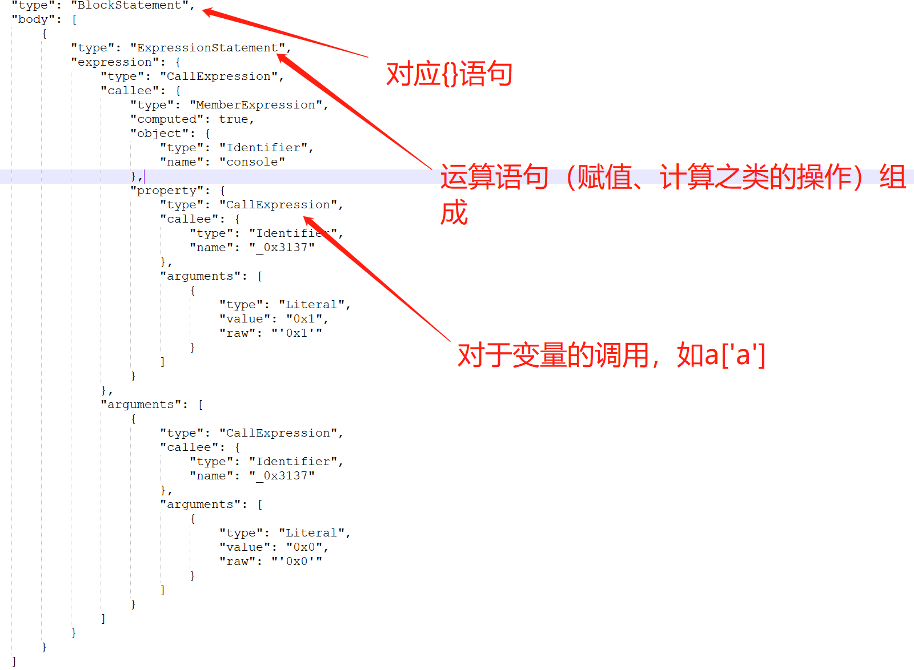

* 参考链接
    * https://www.jianshu.com/p/47d9b2a365c5


* 在线代码混淆
    * https://obfuscator.io/

# 混淆环境
* npm install esprima estraverse escodegen -S


# 逆向大纲
* hello world，console.log 混淆解密
* 利用AST去除debugger无限循环


# AST笔记
* 节点含义

    * 可将混淆代码转换成AST树，从而替换节点，达到解密的目的。
    * CallExpression函数对应的AST和源码
      
        ```
            _0x3137('0x1')
        ```
    * ExpressionStatement对应的源码
        ```
            console[_0x3137('0x1')](_0x3137('0x0'));
        ```
      
    * MemberExpression ：对应下方有object和property，object为对应的变量信息(如name表明对象名称)，property为要读取的属性，property节点下又有value节点表明属性名称
        ```
        //源码
        _0x4e7910["PVc"]
        //对应AST中有object和property
        //AST
        "callee": {
              "type": "MemberExpression",
              "start": 15,
              "end": 31,
              "loc": {
                "start": {
                  "line": 3,
                  "column": 0
                },
                "end": {
                  "line": 3,
                  "column": 16
                }
              },
              "object": {
                "type": "Identifier",
                "start": 15,
                "end": 24,
                "loc": {
                  "start": {
                    "line": 3,
                    "column": 0
                  },
                  "end": {
                    "line": 3,
                    "column": 9
                  },
                  "identifierName": "_0x4e7910"
                },
                "name": "_0x4e7910"
              },
              "property": {
                "type": "StringLiteral",
                "start": 25,
                "end": 30,
                "loc": {
                  "start": {
                    "line": 3,
                    "column": 10
                  },
                  "end": {
                    "line": 3,
                    "column": 15
                  }
                },
                "extra": {
                  "rawValue": "PVc",
                  "raw": "\"PVc\""
                },
                "value": "PVc"
              },
              "computed": true
            },
        ```

    * VariableDeclarator：对应下方有id和init，id为变量信息(其中name表明标量名称)，init为初始化信息
        ```
        
        //源码
        var _0x3f0c99 = arguments
        //AST代码
        Node {
          type: 'VariableDeclarator',
          start: 37288,
          end: 37309,
          loc: SourceLocation {
            start: Position { line: 481, column: 12 },
            end: Position { line: 481, column: 33 }
          },
          id: Node {
            type: 'Identifier',
            start: 37288,
            end: 37297,
            loc: SourceLocation {
              start: [Position],
              end: [Position],
              identifierName: '_0x3f0c99'
            },
            name: '_0x3f0c99'
          },
          init: Node {
            type: 'Identifier',
            start: 37300,
            end: 37309,
            loc: SourceLocation {
              start: [Position],
              end: [Position],
              identifierName: 'arguments'
            },
            name: 'arguments'
          }
        }

        ```


* AST小结
    ```
    Esprima 本质上将 js 代码解析成了两大部分：
    
    1. 3 种变量声明（函数、变量和类）
    2. 表达式
  
    其中表达式又被分为了两大类：
    1.关键字组成的 statement，如 IfStatement, ForStatement等，这里面的BlockStatement有些特殊，因为其body又是 StatementListItem，产生递归。
    2.运算语句（赋值、计算之类的操作）组成的 ExpressionStatement
    
    ```