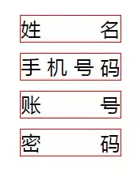
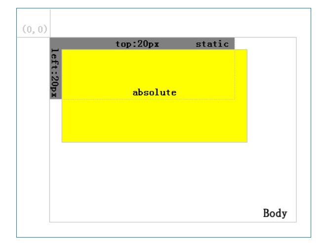

[返回主目录](../README.md)

# react总结


* 创建项目  
    npm install -g create-react-app
    create-react-app project_name

* 占位符  
    import {Fragment} from 'react';  
    Fragment 站位符号，可以让最外层标签隐藏


* jsx中转义   
    dangerouslySetInnerHTML={{__html:item }}  
    在标签中假如如上值即可

* setState  
    异步函数，可以将几次set合并成一次。

* 生命周期函数  
    
      
    componentWillReceiveProps: 从父组件中接收props,只有在父组件从新render的时候才会执行,也就是说子组件第一回渲染的时候不会执行。  
    
    shouldComponentUpdate : 组件被更新之前自动执行,需要返回一个bool类型变量,决定是否更新。  

    当state或者props发生改变的时候render函数会重新渲染。父组件render函数被执行，子组件render也会被执行(这里会造成性能损耗，子组件可以使用shouldComponentUpdate进行优化)  
    ```js
    shouldComponentUpdate(nextProps, nextState){
        if(nextProps.content !== this.props.content){
            return true
        }
        else{
            return false
        }
    }
    ```  

    ajax请求建议放在componentDidMount中进行。  
    
* ref的使用：  
    https://mp.weixin.qq.com/s/rWoTA9JABu_kQ8-fOM-EOw  


* public文件下的东西是可以直接访问的，所以可以将假数据放到这个目录下。


* component 和 PureComponent：  
      PureComponent：组件内部帮你实现了shouldComponentUpdata函数，判断组件是否需要跟新。
    
    
* 重定向：  
    this.props.history.push("/path") 或者 <Redirect to"/path" />
 
* withRouter:
    高阶组件中的withRouter, 作用是将一个组件包裹进Route里面, 然后react-router的三个对象history, location, match就会被放进这个组件的props属性中.
    所以withRouter的作用就是, 如果我们某个东西不是一个Router, 但是我们要依靠它去跳转一个页面, 比如点击页面的logo, 返回首页, 这时候就可以使用withRouter来做.


* router传参:
    ```
    1.params方式
        优势 ： 刷新地址栏，参数依然存在
        缺点:只能传字符串，并且，如果传的值太多的话，url会变得长而丑陋。
    <Route path='/path/:name' component={Path}/>
    <link to="/path/2">xxx</Link>
    this.props.history.push({pathname:"/path/" + name});
    读取参数用:this.props.match.params.name
    
    2.query方式
        优势：传参优雅，传递参数可传对象；
        缺点：刷新地址栏，参数丢失
    <Route path='/query' component={Query}/>
    <Link to={{ path : ' /query' , query : { name : 'sunny' }}}>
    this.props.history.push({pathname:"/query",query: { name : 'sunny' }});
    读取参数用: this.props.location.query.name
    
    3.state方式
        优缺点同query
    <Route path='/sort ' component={Sort}/>
    <Link to={{ path : ' /sort ' , state : { name : 'sunny' }}}> 
    this.props.history.push({pathname:"/sort ",state : { name : 'sunny' }});
    读取参数用: this.props.location.query.state 
    
    4.search方式
        优缺点同params
    <Route path='/web/departManange ' component={DepartManange}/>
    <link to="web/departManange?tenantId=12121212">xxx</Link>
    this.props.history.push({pathname:"/web/departManange?tenantId" + row.tenantId});
    读取参数用: this.props.location.search
    
    ```


# css总结  

* animation-fill-mode属性值  
    none: 默认值，播放完动画后，画面停在起始位置。  
    forwards: 播放完动画，停在animation定义的最后一帧。  
    backwards: 如果设置了animation-delay，在开始到delay这段时间，画面停在第一帧。如果没有设置delay，画面是元素设置的初始值。    
    ```
    .hide{
        animation: hide-item 2s ease-in  forwards;
    }
    ```
* @keyframes创建动画(然后可以在animation上使用)   
    ```css
    @keyframes hide-item{
        0% {
            opacity: 1;
            color: red;
        }
        50% {
            opacity: 0.5;
            color: green
        }
        100% {
            opacity: 0;
            color: blue 
        }
    }

    ```

* react-transition-group  
    key：CSSTransition  
    文档地址：http://reactcommunity.org/react-transition-group/css-transition


* 如果其父元素中有使用 transform, fixed 的效果会降级为 absolute,即当使用 fixed 的直接父元素的高度和屏幕的高度相同时 fixed 和 absolute 的表现效果会是一样的。如果这个直接父级内的元素存在滚动的情况,那就加上 overflow-y: auto。  


* 文字两端对齐：  
    ```css
    // html
    <div>姓名</div>
    <div>手机号码</div>
    <div>账号</div>
    <div>密码</div>

    // css
    div {
        margin: 10px 0; 
        width: 100px;
        border: 1px solid red;
        text-align: justify;
        text-align-last:justify
    }
    div:after{
        content: '';
        display: inline-block;
        width: 100%;
    }
    ```
      


* reset.css (https://meyerweb.com/eric/tools/css/reset/) 用于统一pc端样式  


* position:  (https://blog.csdn.net/zzz365zz/article/details/79104063)
    relative:定位为relative的元素脱离正常的文本流中，但其在文本流中的位置依然存在。定位的层总是相对于其最近的父元素，无论其父元素是何种定位方式。  
    
    absolute:定位为absolute的层脱离正常文本流，但与relative的区别是其在正常流中的位置不在存在。定位的层总是相对于其最近的定义为absolute或relative的父层,如果其父层中都未定义absolute或relative，则其将相对body进行定位。如果有子项，那么absolute的宽高会自动适应(具体查看demo下SearchInfo组件)。  
     


* styled-components使用总结 
    空 直接是标签名表示当前下的标签 
    .  所有的子class  
    &. 同级的class  
    &::placeholder  同级下的某个属性 
    
    * example
    ```
    <i className={this.props.focused ? 'focused iconfont zoom' : 'iconfont zoom'}>&#xe6cf;</i>
  
    // 对于样式可以设定为如下，当被聚焦时css的focused被激活
    .zoom{
        position:absolute;
        right:5px;
        bottom:5px;
        width:30px;
        line-height:30px;
        border-radius : 15px;
        text-align:center;
        &.focused{
            background:#777;
            color:#fff;
        }
    }
    ``` 
    
* span是行内元素，没有宽高的，margin-top和margin-bottom无效。可以给span加一个display:inline-block或者直接display:block或者设置float属性。  

* transform属性需要设置display:block或者float  
    transfrom-origin:center center; 设置旋转中心

ar
* float元素会脱离正常的文档流，使父元素的正常文档流中空无一物，在没有设置父元素高度的情况下造成父元素的高度塌陷。


* 元素居中
    ```
    一般元素
    text-align: center;
    
    
    定位为absolute元素的居中
    {
        position:absolute;
        top:50%; 
        left:50%;
        width:480px;
        height:480px;
        margin-top:-100px;(元素高度的一半)
        margin-left:-240px;(元素宽度的一半)
    }
    ```

* 文字垂直居中
    ```
    1.高度为具体的数值的情况，line-height 只需要设置具体的高度即可。
    
    2.利用表格和单元格的特性，让文字垂直居中。
    {
        display: table-cell;
        height: 100px;
        vertical-align: middle;
    }
    ```


# JS总结

* js对象拷贝  
    浅拷贝： 
    ```js
    <!-- Object.assign -->
    var obj = { foo: "foo", bar: "bar" };
    var copy = Object.assign({}, obj);
    <!-- ... -->
    var obj = { foo: "foo", bar: "bar" };
    var copy = { ...obj };
    ```
    深拷贝：
    ```js
    <!-- 这个方法只在对象包含可序列化值，并且没有循环引用的时候有用。其中一个不可序列化的类型的就是日期对象 - 尽管它显示出来是字符串化的ISO格式,JSON.parse只会把它解析成为一个字符串,而不是日期类型 -->
    var obj = { a: 0, b: { c: 0 } };
    var copy = JSON.parse(JSON.stringify(obj));


    <!-- 自定义深度拷贝 -->
    function deepClone(obj) {
        var copy;
        // Handle the 3 simple types, and null or undefined
        if (null == obj || "object" != typeof obj) return obj;
        // Handle Date
        if (obj instanceof Date) {
            copy = new Date();
            copy.setTime(obj.getTime());
            return copy;
        }

        // Handle Array
        if (obj instanceof Array) {
            copy = [];
            for (var i = 0, len = obj.length;
                i < len;
                i++) {
                copy[i] = deepClone(obj[i]);
            }
            return copy;
        }

        // Handle Function
        if (obj instanceof Function) {
            copy = function () {
                return obj.apply(this, arguments);
            }
            return copy;
        }

        // Handle Object
        if (obj instanceof Object) {
            copy = {};
            for (var attr in obj) {
                if (obj.hasOwnProperty(attr)) copy[attr] = deepClone(obj[attr]);
            }
            return copy;
        }

        throw new Error("Unable to copy obj as type isn't supported " + obj.constructor.name);
    }

    ```
*  数组遍历：  
    ```javascript
    a = [1,2,3,4];
    b = a.map((item, index) => {
     return item+1
    });
  
    //结果 b = [2,3,4,5]
    ```
    
*  Array:  

    *  Array.from(arrayLike[, mapFunction[, thisArg]])  
        * arrayLike：必传参数，想要转换成数组的伪数组对象或可迭代对象。  
        * mapFunction：可选参数，mapFunction(item，index){…} 是在集合中的每个项目上调用的函数。返回的值将插入到新集合中。  
        * thisArg：可选参数，执行回调函数 mapFunction 时 this 对象。这个参数很少使用  
        
        
    ``` javascript
    
    
    //浅拷贝一个数组
    const numbers = [3, 6, 9];
    const numbersCopy = Array.from(numbers);
    
    numbers === numbersCopy; // => false
    
    
    //使用值填充数组
    const length = 3;
    const init   = 0;
    const result = Array.from({ length }, () => init);
    
    result; // => [0, 0, 0]

    const length = 3;
    
    // 使用对象填充数组(fill() 方法创建的 resultB 使用相同的空对象实例进行初始化。不会跳过空项。)
    const resultA = Array.from({ length }, () => ({}));
    const resultB = Array(length).fill({});
    
    resultA; // => [{}, {}, {}]
    resultB; // => [{}, {}, {}]
    
    resultA[0] === resultA[1]; // => false
    resultB[0] === resultB[1]; // => true


    //map() 方法会跳过空项
    const length = 3;
    const init   = 0;
    const result = Array(length).map(() => init);
    result; // => [undefined, undefined, undefined]
    ```


# 小tips

* [在线模拟接口平台](https://www.fastmock.site/)
    
* fiddler 接口测试测试  
      


# 在线demo
* [styled-component 中使用antd](https://codesandbox.io/s/antd-styled-components-owzd9)


* yarn超时可用：yarn add <yourPackage> --network-timeout 100000


