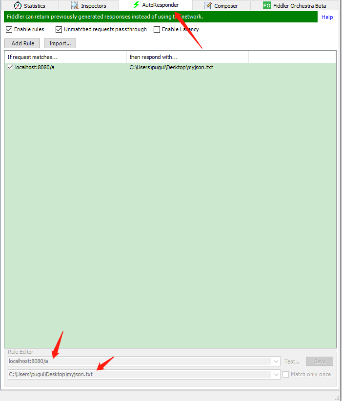

# react总结

* 占位符  
    import {Fragment} from 'react';  
    Fragment 站位符号，可以让最外层标签隐藏


* jsx中转义   
    dangerouslySetInnerHTML={{__html:item }}  
    在标签中假如如上值即可

* setState  
    异步函数，可以将几次set合并成一次。

* 生命周期函数  
    
      
    componentWillReceiveProps: 从父组件中接收props,只有在父组件从新render的时候才会执行,也就是说子组件第一回渲染的时候不会执行。  
    
    shouldComponentUpdate : 组件被更新之前自动执行,需要返回一个bool类型变量,决定是否更新。  

    当state或者props发生改变的时候render函数会重新渲染。父组件render函数被执行，子组件render也会被执行(这里会造成性能损耗，子组件可以使用shouldComponentUpdate进行优化)  
    ```js
    shouldComponentUpdate(nextProps, nextState){
        if(nextProps.content !== this.props.content){
            return true
        }
        else{
            return false
        }
    }
    ```  

    ajax请求建议放在componentDidMount中进行。  
    


# css总结  

* animation-fill-mode属性值  
    none: 默认值，播放完动画后，画面停在起始位置。
    forwards: 播放完动画，停在animation定义的最后一帧。
    backwards: 如果设置了animation-delay，在开始到delay这段时间，画面停在第一帧。如果没有设置delay，画面是元素设置的初始值。  
    ```
    .hide{
        animation: hide-item 2s ease-in  forwards;
    }
    ```


# 小tips
    
* fiddler 接口测试测试  
      


